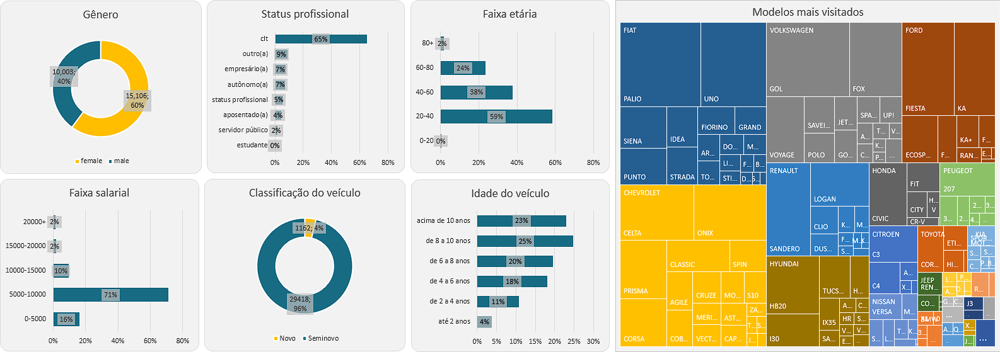

# Análise de perfil dos leads

Dashboard para análise de perfil dos leads.

---
### Objetivo
Projeto para análise de perfil dos leads de um e-commerce de veículos. Tendo como objetivo final desenvolver um dashboard para analisar as principais características dos clientes, como: gênero, status profissional, faixa etária, modelos mais visitados e outras. Para assim, auxiliar a empresa nas futuras tomadas de decisões.

---
### Ferramentas

Excel

PostgreSQL

pgAdmin

---

### Resultados

Com os dados disponibilizados no curso "SQL para Análise de Dados: Básico ao Avançado", foram elaborada diversas visualizações para entender melhor sobre o perfil dos clientes do e-commerce. 

Foram elas:
- Divisão dos clientes por gênero
- Visualização indicando a proporção de cada tipo de status profissional
- Gráfico informando a porcentagem de cada faixa etária na base de clientes
- Gráfico para indicar a faixa salarial da base de clientes
- Divisão da classificação dos veículos vendidos (Novos ou Seminovos)
- Gráfico mostrando a idade dos veículos
- Amostragem dos modelos mais visitados por marca
